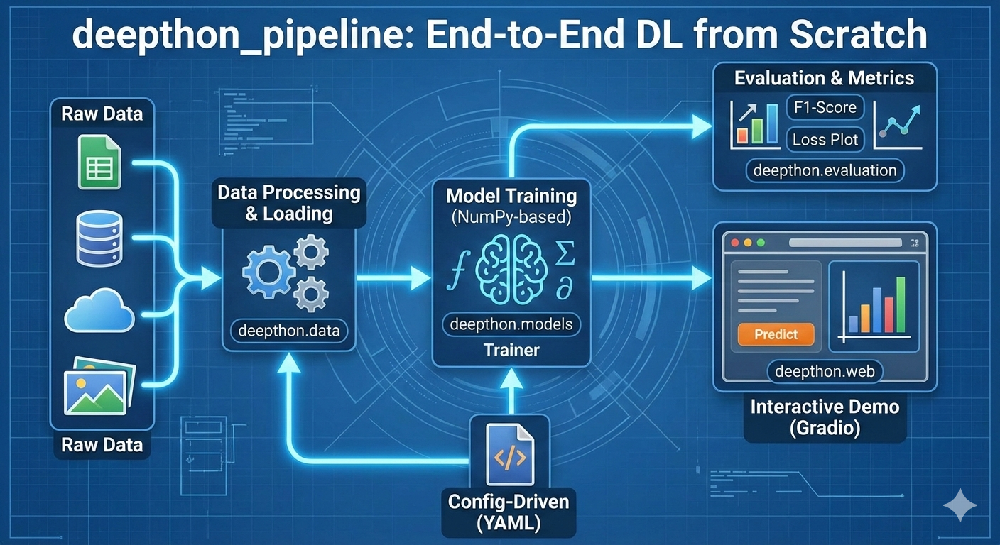

# 🚀 deepthon_pipeline

<div align="center">
  
</div>
<div align="center">

## An end-to-end deep learning pipeline built on top of **[deepthon](https://github.com/Ibraheem-Al-hafith/deepthon.git)** 🧠 — a lightweight deep learning library written *from scratch* using **NumPy**.


✨ This project demonstrates how to go from **download raw data → preprocessing → training → evaluation → interactive demo & cli commands** using a clean, modular, and hackable design.
</div>

---

## 🧩 Benchmarks Included


| Task             | Type                       | Description                                |
| ---------------- | -------------------------- | ------------------------------------------ |
| 🩺 Breast Cancer | Binary Classification      | Predict malignant vs benign tumors         |
| ✍️ MNIST         | Multi-class Classification | Handwritten digit recognition (0–9)        |
| ⚡ Turbine Energy | Regression                 | Predict energy generation from sensor data |


---

## 🛠️ Installation

### 📍 we must setup the two dependencies 📍

### 1. Setup Pipeline (`deepthon_pipeline`)

#### 🪟 Windows (Using `uv`)

Open PowerShell and run:

**Install uv**
```powershell
powershell -c "irmo https://astral.sh/uv/install.ps1 | iex"

```

**if the previous command fails:**
```powershell
powershell -ExecutionPolicy ByPass -c "irm https://astral.sh/uv/install.ps1 | iex"

```

**Setup project**
```powershell
git clone https://github.com/Ibraheem-Al-hafith/deepthon_pipeline.git
cd deepthon_pipeline
uv venv
.venv\Scripts\activate
uv pip install -e .

```

#### 🍎 Mac / 🐧 Linux (Using `uv`)

Open your terminal and run:

**Install uv**

```bash
curl -LsSf https://astral.sh/uv/install.sh | sh

```

**Setup project**

```
git clone https://github.com/Ibraheem-Al-hafith/deepthon_pipeline.git
cd deepthon_pipeline
uv sync

```

---

## 🖥️ GUI Usage

For a more visual and interactive experience, you can launch the built-in web dashboard powered by **Gradio**. This allows you to upload samples and see model predictions in real-time.

**To launch the interface:**

```bash
python -m src.deepthon_pipeline.ui.app serve

```

### 📺 Demo Video

https://github.com/user-attachments/assets/bc7e224f-9b6c-44ff-a518-4f549596f38d


---

## 🧪 CLI Usage

The pipeline uses a positional CLI structure for speed and clarity.

```bash
python -m src.deepthon_pipeline.cli.main <command> [args] [options]

```

### 🔹 `train`

Train models based on your YAML config.

Run all datasets and models in config

```bash
python -m src.deepthon_pipeline.cli.main train configs/config.yaml
```

Run specific dataset (uses default 'all' for models)

```bash
python -m src.deepthon_pipeline.cli.main train configs/config.yaml cancer
```

Run specific dataset and specific model size

```bash
python -m src.deepthon_pipeline.cli.main train configs/config.yaml cancer --model tiny
```

### 🔹 `test-all` (*recommended even when run a single training loop*)

Evaluate all models generated by an experiment config.

```bash
python -m src.deepthon_pipeline.cli.main test-all configs/config.yaml

```

### 🔹 `test`

Evaluate a specific saved checkpoint.

```bash
# Syntax: test <config> <checkpoint> <dataset> <model>
python -m src.deepthon_pipeline.cli.main test configs/config.yaml runs/exp/model.npz cancer tiny

```

---

## ⚙️ Example Configuration (`config.yaml`)
### (NOTE): see [./configs/config.yaml](./configs/config.yaml) for the complete yaml template.

```yaml
experiment: turbines_experiment
datasets:
  mnist:
    name: mnist
    input_dim: 784
    output_dim: 10
    urls:
      train_images: [https://raw.githubusercontent.com/fgnt/mnist/master/train-images-idx3-ubyte.gz](https://raw.githubusercontent.com/fgnt/mnist/master/train-images-idx3-ubyte.gz)
      train_labels: [https://raw.githubusercontent.com/fgnt/mnist/master/train-labels-idx1-ubyte.gz](https://raw.githubusercontent.com/fgnt/mnist/master/train-labels-idx1-ubyte.gz)
    train_config:
      loss_fn: CCE
      metric: f1
  cancer:
    name: cancer
    input_dim: 30
    output_dim: 1
    train_config:
      loss_fn: BCE
      metric: f1

model:
  tiny:
    type: sequential
    architecture:
      - [null, 64, relu]
      - [batchnorm, 64]
      - [Dropout, 0.2]
      - [64, null, linear]

training:
  batch_size: 64
  epochs: 100
  optimizer:
    name: adamw
    lr: 0.001

```

---

## 🗂️ Project Structure

```text
deepthon_pipeline/
├─ assets/      🎨 Images & Brand
├─ configs/     📄 Experiment YAMLs
├─ logs/        📄 Experiment log file
├─ src/
│  └─ deepthon_pipeline/
│     ├─ cli/       🖥️ CLI Commands
│     ├─ data/      📦 Loaders & Preprocessing
│     ├─ models/    🧠 Architecture Registry
│     ├─ training/  🏃 Runner & Trainer logic
│     └─ utils/     🔧 Logging & Helpers
└─ tests/       🧪 Pytest suite

```

---

## 🤝 Contributing

PRs are welcome! 🎉

* Add new datasets via the dataset registry.
* Add new models via the model registry.
* Keep code clean, small, and readable.

---

## 📜 License

MIT License

---

## ❤️ Final Note

This project is intentionally **simple, transparent, and hackable**. If you want to *learn how deep learning works under the hood*, this is for you.

**Happy hacking! 🚀🧠**
